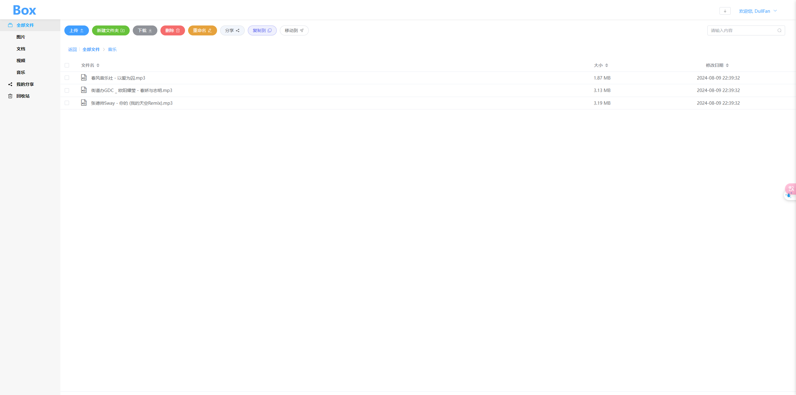

## 简介

DullBox是一个基于 Spring Boot 构建的云存储项目，旨在提供一个高效、安全的文件管理与分享平台。用户可以通过该平台上传、下载、管理个人文件，并支持生成分享链接。项目采用模块化设计，包含用户管理、文件操作、分享和回收站等功能模块，支持多终端访问，且易于扩展和维护。

## 功能

- 用户模块：包括用户注册、登录、密码管理等功能。
- 文件模块：提供文件上传、下载、删除、移动、复制等操作。
- 分享模块：支持文件分享、取消分享、查看分享链接，并可将文件保存至用户的DullBox中。
- 回收站模块：可查询、还原已删除的文件，并清空回收站。

## 配置

在dull-admin中的application.yml文件中，需要自行配置
```yaml
# 存储模式
storage:
  # local: 本地
  # oss: 阿里OSS
  # fastDFS: 轻量级分布式文件系统
  engine: local

# FastDFS配置
fastdfs:
  config:
    group: group1
    tracker-list: xxxxxxxxx
    connect-timeout: 600

# OSS配置
oss:
  config:
    endpoint: xxxxxx
    access-key-id: xxxxxx
    access-key-secret: xxxxxx
    bucket-name: xxxxxx
    auto-create-bucket: xxxxxx

# box配置
box:
  config:
    chunk-file-expiration-days: 1
    share-prefix: http://127.0.0.1:9362/share/

# 布隆过滤器
local:
  bloom:
    filter:
      items:
        - name: "SHARE_SIMPLE_DETAIL"
          funnelTypeName: LONG
          expectedInsertions: 1000000
          fpp: 0.01

```

## UI

前端文件在box_ui中,用Vue3 + Vite + ElementPlus写的

## API

导入apipost.json到Apipost7中，即可查看API

## 联系我

* QQ：2928527233
* CSDN：https://blog.csdn.net/weixin_51298509

